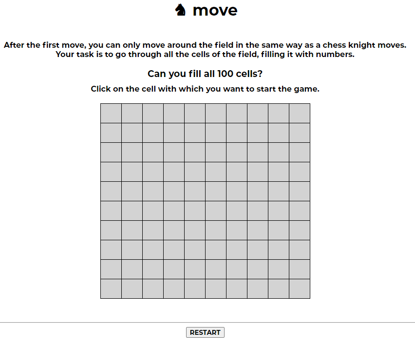
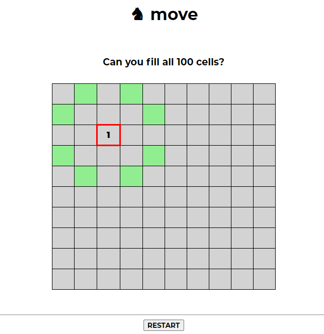
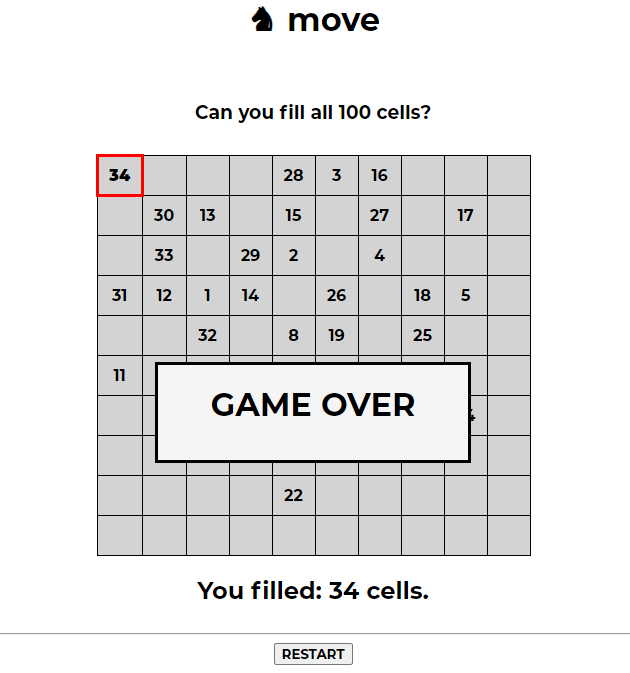

# Knight's move
Knight's Move is a browser puzzle game where you have to fill the whole field with knigt's movements.

This project is made with: **Java, JavaScript, JSP and CSS**. It is using **servlets and TomCat server**.

## Steps to Setup

**1. Clone the application**

```bash
git clone https://github.com/nikita-shamrai/knight-move.git
```
**2. Add TomCat configuration**

## How to Run

* After configuring TomCat Server the app will start automatically in browser.
  By default the app will start running at <http://localhost:8080/knight-move/>**

## Game Process
* First you will see game rules and field. Try to **click on any cell** to make your first move.



* After making your first move you will see the **cells available** to make your next move.
Try **click on any green cell** and go on.


  

* When there will be **no cells available** to move the game is over. You will see your score.



## Try to reach 100! Enjoy the game
